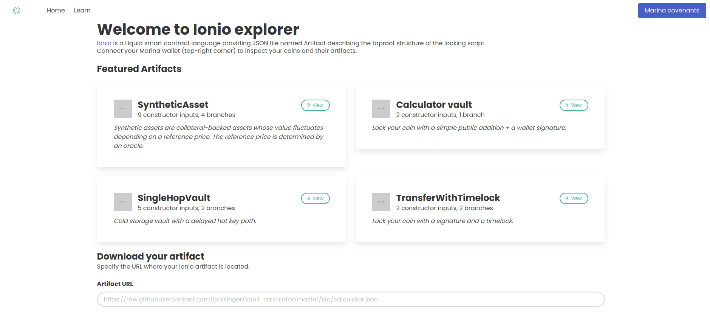

# Ionio Marina spender

A simple web app to help you keep track of your Ionio Artifact. Optionally connect to [Marina Wallet](https://github.com/vulpemventures/marina) Ionio accounts to inspect and spend your coins locked by covenants.

[](https://louisinger.github.io/ionio-marina-spender/)

Try it ! https://louisinger.github.io/ionio-marina-spender/

## Development

Install dependencies:

```bash
yarn install
```

Run locally with hot reloading:

```bash
yarn dev
```

Build for production:

```bash
yarn build
```

Format code:

```bash
yarn format
```

## What's inside?

- TypeScript
- Webpack (with Node.js polyfill plugin)
- Bulma
- Prettier
- ESLint
- Svelte

## Acknowledgements

- [Ionio](https://ionio-lang.org/)
- [Marina Wallet](https://vulpem.com/marina)